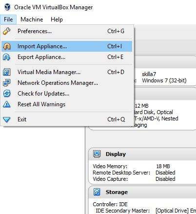
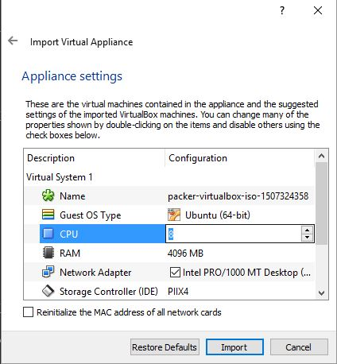

ICM_PIPELINE (VirtualBox)
=========================
Ubuntu 16.04 virtual machine loaded with neuroimaging software
--------------------------------------------------------------------------------
There are 3 branches:
- **master:** Using *ubuntu-server iso* and building a VirtualBox .ova using packer
- **using_desktop_iso:** Using *ubuntu-desktop iso* to build VirtualBox .ova using packer
- **ami_aws:** Using packer to build an AMI

Download link:
[ICM_PIPELINE.ova](https://drive.google.com/file/d/0B8U1bxkyNu87RWtnUU8xeUVldm8/view?usp=sharing)

Current Software:
- Freesurfer 6.0
- FSL 5.0
- MIPAV
- ITK Snap
- mricron

#### How to set up on VirtualBox ####

- Install [VirtualBox](https://www.virtualbox.org/)
- Download the ICM_PIPELINE ova file
- Go to File -> Import Appliance. Choose the ICM_PIPELINE.ova file



- You can change memory and CPUs by double-clicking in those fields



- Wait for it to finish importing
- Launch your Virtual Machine!

#### Installing Guest Additions: ####
For some reason, this never goes smoothly...

1. With a launched VM, click on Devices -> Insert guest additions CD
2. mount /dev/cdrom /media
3. apt-get install dkms build-essential linux-headers-generic
4. If not automatically prompted, run sudo sh /media/cdrom/VBoxLinuxAdditions.run

Here's an SO post discussing some problems and usually one of them will fix your problem:

https://stackoverflow.com/questions/28328775/virtualbox-mount-vboxsf-mounting-failed-with-the-error-no-such-device


#### Other Things ####

Problems still need fixing and possible upgrades:
- Preseeding ubuntu-desktop?? Or starting with desktop ISO? Would be super useful because a lot of programs are GUI-based and their installation require this, currently fails when put into tasksel or pkgsel in preeseed, so using ansible
- Preseed fails at Select and install hardware? Same preseed can succeed and fail at this step. Maybe can't go online to download new packages?, But mirrors work and when i am disconnected from internet i get different error, so probs firewall? For ubuntu-desktop iso 16.04 problem seems to be network is turned off the stage before running dpkg.
- SO MANY ANSIBLE PROBLEMS !
  - using apt_repo for sourcing neurodebian fails
  - Installing ubuntu desktop without update_cache fails
  - Stops when some of FSLs installs don't work?? But if I boot up VM and run in terminal I will get output that some installs failed and it will still complete (yielding a working FSL). Conversly, ansible destroys the VM.

Packer allows creating of a virtual machine from an installation ISO (Ubuntu 16.04 server in this case), and can also build into several VM formats, such as AMI, which can then be deployed in an EC2 instance.

A windows machine cannot be a control machine! You have to use ansible local (installs anisble on guest) from a windows host, and packer doesn't install ansible automatically on guest VM, so we have to preseed it or use shell scripts. I used shell scripts but i think preseeding might be better if I can get it to work.

You can't preseed a ubuntu desktop image the same as ubuntu server. You have to include some ubiquity commands as well. Of course, you can also install ubuntu-desktop ontop of ubuntu server. You can try including this in preseed:

```
d-i pkgsel/include ubuntu-desktop
```

But I got a software install error and VM dosen't build succesfully. Solution? Provision it in later with ansible.
