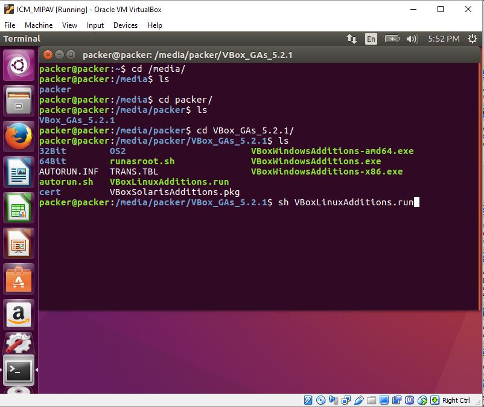
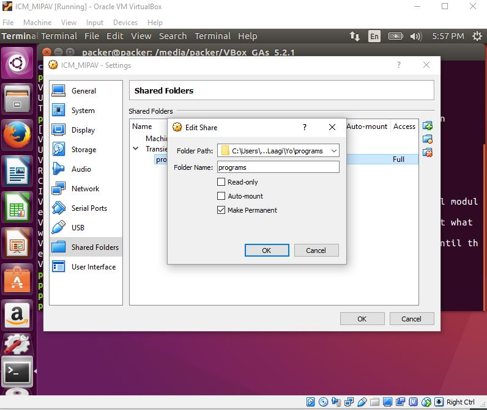

ICM_PIPELINE (VirtualBox)
=========================
Ubuntu 16.04 virtual machine loaded with neuroimaging software
--------------------------------------------------------------------------------
There are 4 branches:
- **master:** Using *ubuntu-server iso* and building a VirtualBox .ova using packer
- **using_desktop_iso:** Using *ubuntu-desktop iso* to build VirtualBox .ova using packer
- **ami_aws:** Using packer to build an AMI
- **docker:** Using Docker to build a container

Download link:
[ICM_PIPELINE_FULL](https://drive.google.com/file/d/0B8U1bxkyNu87RWtnUU8xeUVldm8/view?usp=sharing)
[ICM_MIPAV_ONLY](https://drive.google.com/file/d/1eHBeAGlnkcurZ55ZjWahemfpiEr_QMa3/view?usp=sharing)

Current Software:
- Freesurfer 6.0
- FSL 5.0
- MIPAV
- ITK Snap
- mricron

The mipav only .ova file is much smaller and has only MIPAV+JIST+CBStools etc.
## How to set up on VirtualBox ##

- Install [VirtualBox](https://www.virtualbox.org/)
- Download the ICM_PIPELINE ova file
- Go to File -> Import Appliance. Choose the ICM_PIPELINE.ova file


- You can change memory and CPUs by double-clicking in those fields


- Wait for it to finish importing & launch your Virtual Machine

## Installing Guest Additions and Shared Folders: ##
1. With a launched VM, click on Devices -> Insert guest additions CD


2. You should automatically be prompted to install guest additions. If not automatically prompted run

```
sudo mount /dev/cdrom /media
sudo sh /media/cdrom/VBoxLinuxAdditions.run
```


3. If installation fails, first try rebooting and reinstalling.
4. Now for shared folders. Go to Device > Shared Folders



5. Add the path on your host machine that contains files you want to use on your VirtualBox machine.



6. Mount the shared folder using:

```
sudo mount -t vboxsf HostFoldername Virtualboxfolderpath
```


If you still have problems, here's an SO post discussing some problems and usually one of them will fix your problem:

https://stackoverflow.com/questions/28328775/virtualbox-mount-vboxsf-mounting-failed-with-the-error-no-such-device
